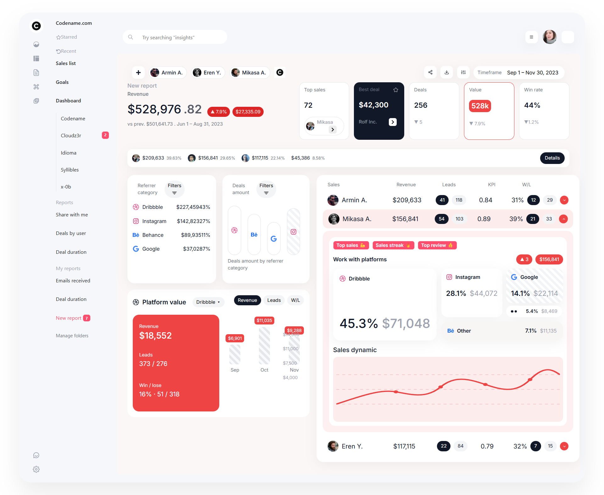
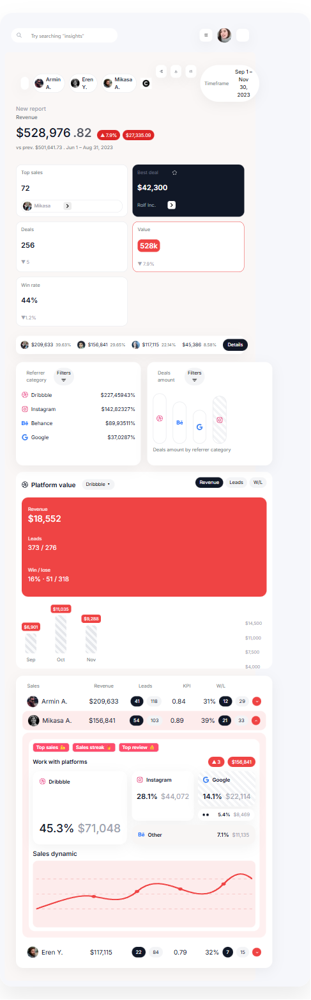
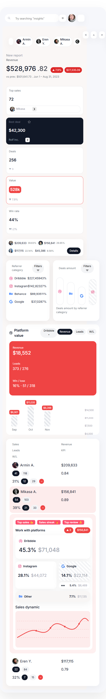

# React Analytics Dashboard

A responsive analytics dashboard UI built using React and custom CSS, developed by implementing a client-provided design.

## 🚀 Features
- Sidebar with icon rail and navigation menu
- Top navbar with search and actions
- Revenue overview with growth indicators
- KPI cards and summary strip
- Sales table with expandable rows
- Platform-wise analytics and charts
- Fully responsive (desktop, tablet, mobile)

## 🛠 Tech Stack
- React (Vite)
- JavaScript (ES6+)
- CSS (custom styling)
- Bootstrap (grid utilities only)
- React Icons

## 📱 Responsiveness
- Desktop: Full dashboard layout
- Tablet: Single-column analytics layout
- Mobile: Stacked cards and simplified tables

## ▶️ Run Locally
```bash
npm install
npm run dev

## 📸 Screenshots

### Desktop


### Tablet


### Mobile


